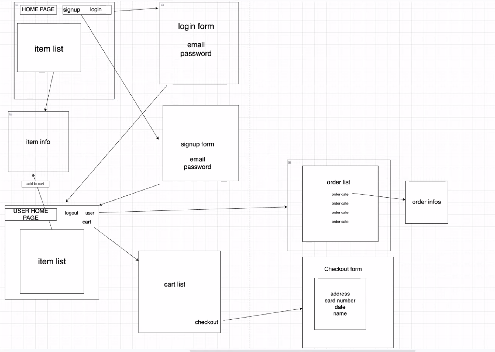

# Plant_Shop_Front_End

### Overview

This project is an e-commerce site where you can buy plants. When go to the website, you are taken to  to the homepage, where you can see all plants available for purchase. Upon clicking a plant, it sends you to a page that individually shows the information of the plant that you clicked on. 

You will also be able to sign up and log on to the website where you can then add plants to your cart and check them out. Once you have completed a purchase, you can view your orders by clicking on your email displayed on the top right corner. 

### Wireframe

 

### User Stories

-When I first visit the site, I'm on a home page that just has a simple welcome message.

-When not logged in, I see links to home, signup & login only. If I were to visit any of these routes manually while logged in, I would get redirected to the home page.

-I can create an account, log in, and log out.

-When logged in, I see links to home, logout, All Products, My Cart, and My Orders. If I were to visit any of these routes manually while logged out, I would get redirected to the home page.

-The Homepage available products. Clicking on any product name takes me to its details page, which include a name, description, image, and price.

-In the indivudal plan pages, you can view the information of the plant as well as adding them to your cart by the click of a button. You can add it multiple times, and each item is display in cart seperately.

-In the cart page, before checking out, you must fill the form with the following information: Address, Credit Card Number. 

-Once form if filled, you can check out and your cart becomes empty. 

-You can view your orders if you click on your email displayed on the top right corner. 

-The orders are displayed and you can click on the date of the order to show you a single order. The single order will show the the order items (name and price) along with the total price, the credit card number used and the address. 

### Routes

|Routes                     | HTTP Verb                       | URL                            |
| :----------------------: | ------------------------------- | ------------------------------- |
| userRoute | .post | '/' |
| userRoute | .post | '/login' |
| userRoute | .get | 'verify' |
| userRoute | .get | '/order/allOrders/:userId' |
| userRoute | .get | '/order/:orderId/allItems' |
| orderRoute | .get | '/order/:orderId' |
___
### MVP

-The site has user authentication functionality. 

-Each user has orders that are made after checking out their cart.

-Each user can only view their own orders, and not the orders of other users. 

### Stretch Goals

- Being able to delete order history

- Saving cart items when you log off and log back on 

Unit 3 Group
